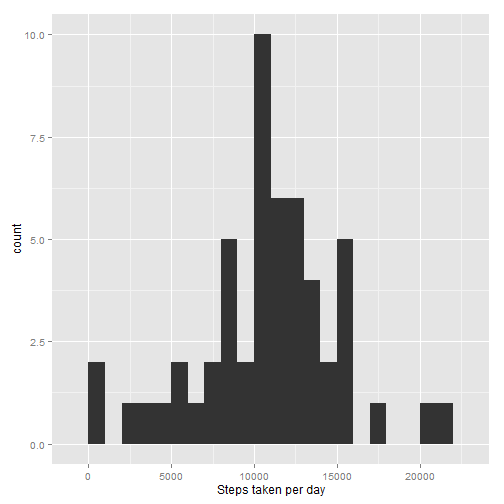
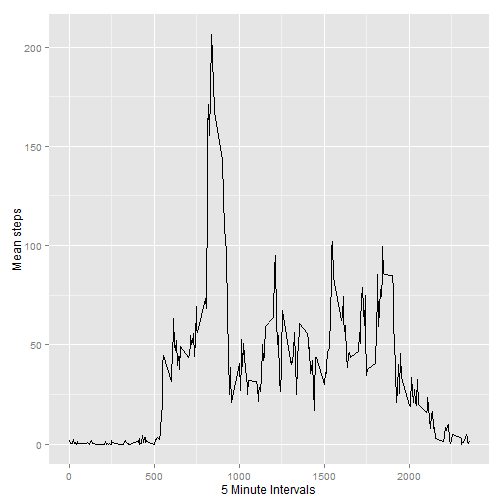
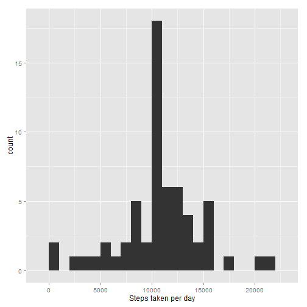
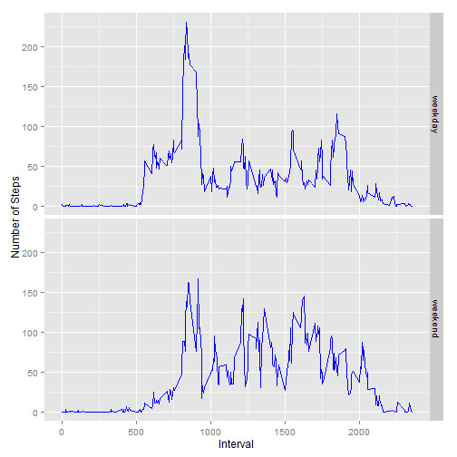

## Loading and preprocessing the data

Checks to see if requried packages used below are installed, and if not, installs them.

```r
if(all(c("ggplot2","plyr") %in% rownames(installed.packages())) == FALSE)
  install.packages("ggplot2","plyr")

library(ggplot2)
library(plyr)
```

Downloads the zip file if it is not present in the current directory and unzips it. Then the data is loaded in.


```r
if(!(file.exists("activity.csv")))
{
  temp <- tempfile()
  download.file("https://d396qusza40orc.cloudfront.net/repdata%2Fdata%2Factivity.zip",temp)
  unzip(temp)
  unlink(temp)
  rm(temp)
}

data <- read.csv("activity.csv")
```


## What is mean total number of steps taken per day?
*Note: I will be ignoring NA values for this portion*

**1. What is the total number of steps taken per day?**

To determine this I'll need to sum on steps by day, while ignoring the interval variable. DDply allows this to be done fairly easily:


```r
dsteps <- ddply(data,.(date),summarize,sum.steps=sum(steps))
```

**2. Make a histogram of the total number of steps taken each day**

I used ggplot here with a binwidth of 1000 to make it a bit easier to track than the default of the range divided by 30:


```r
ggplot(data=dsteps, aes(dsteps$sum.steps)) + geom_histogram(binwidth=1000) + xlab("Steps taken per day")
```

 

**3. Calculate and report the mean and median of the total number of steps taken each day**

Using my earlier 'dsteps' variable created with ddply, these can be determined simply by using the mean and median functions:


```r
mean(dsteps$sum.steps,na.rm = TRUE)
```

```
## [1] 10766.19
```

```r
median(dsteps$sum.steps,na.rm = TRUE)
```

```
## [1] 10765
```


## What is the average daily activity pattern?
*Note: I will be ignoring NA values for this portion*

**1. Make a time series plot of the 5-minute interval (x-axis) and the average number of steps taken, averaged across all days (y-axis)**

I used ddply again to summarize the data as requested using mean instead of sum. 


```r
dactivity <- ddply(data,.(interval),summarize,mean.steps = mean(steps,na.rm=TRUE))
```

Next the data was graphed using ggplot with geom_line()


```r
ggplot(data=dactivity, aes(dactivity$interval,dactivity$mean.steps))+geom_line()+xlab("5 Minute Intervals")+ylab("Mean steps")
```

 

**2. Which 5-minute interval, on average across all the days in the dataset, contains the maximum number of steps?**

To determine this I subsetted on the 'dactivity' variable just created at its maximum value of steps.


```r
subset(dactivity,dactivity$mean.steps==max(dactivity$mean.steps))
```

```
##     interval mean.steps
## 104      835   206.1698
```

## Imputing missing values

Now I'll take a look at the NAs previously ignored.

**1. Calculate and report the total number of missing values in the dataset (i.e. the total number of rows with NAs)**

First I looked at the summary to get an idea of where the NAs were located:


```r
summary(data)
```

```
##      steps                date          interval     
##  Min.   :  0.00   2012-10-01:  288   Min.   :   0.0  
##  1st Qu.:  0.00   2012-10-02:  288   1st Qu.: 588.8  
##  Median :  0.00   2012-10-03:  288   Median :1177.5  
##  Mean   : 37.38   2012-10-04:  288   Mean   :1177.5  
##  3rd Qu.: 12.00   2012-10-05:  288   3rd Qu.:1766.2  
##  Max.   :806.00   2012-10-06:  288   Max.   :2355.0  
##  NA's   :2304     (Other)   :15840
```

Since all of the NAs were on the steps variable, a new variable with the amount of NAs was determined by summing them on data$steps.


```r
nas <- sum(is.na(data$steps))
nas
```

```
## [1] 2304
```

**2. Devise a strategy for filling in all of the missing values in the dataset. The strategy does not need to be sophisticated. For example, you could use the mean/median for that day, or the mean for that 5-minute interval, etc.**

I decided to use the mean of each 5-minute interval determined without NAs. I chose this due to a large number of zeros present in the data set. This implies to me that the NAs are when the device was not being worn/turned off.

**3. Create a new dataset that is equal to the original dataset but with the missing data filled in.**

I used subsetting to determine and replace NA values.


```r
data2 <- data
indices <- which(is.na(data2$steps))
ints <- data2$interval[indices]

data2$steps[indices] <- dactivity$mean.steps[match(ints, dactivity$interval)]
```

**4. Make a histogram of the total number of steps taken each day and Calculate and report the mean and median total number of steps taken per day. Do these values differ from the estimates from the first part of the assignment? What is the impact of imputing missing data on the estimates of the total daily number of steps?**

I used ddply again to summarize the data as requested, then graphed and displayed the mean and median:


```r
d2steps <- ddply(data2,.(date),summarize,sum.steps=sum(steps))
ggplot(data=d2steps, aes(d2steps$sum.steps))+geom_histogram(binwidth=1000)+xlab("Steps taken per day")
```

 

```r
mean(d2steps$sum.steps)
```

```
## [1] 10766.19
```

```r
median(d2steps$sum.steps)
```

```
## [1] 10766.19
```

This did not change the mean, but did change the median to equal the mean. The overall effect is a larger peak for the most common amount of steps. 

## Are there differences in activity patterns between weekdays and weekends?

**1. Create a new factor variable in the dataset with two levels - "weekday" and "weekend" indicating whether a given date is a weekday or weekend day.**

I used the weekdays function to determine the day of the week for each date then a simple while loop to change the days to either weekday or weekend. One of the apply functions would do this easily as well. I added the result as the variable 'week' in the dataset without NAs.


```r
data2$week <- weekdays(as.Date(data2$date))

i <- 1
while(i <= length(data2$week)){
  if(data2$week[i] %in% c("Saturday","Sunday")){
    data2$week[i] <- "weekend"
  }
    else{
      data2$week[i] <- "weekday"
  }
  i <- i+1
}

data2$week <- as.factor(data2$week)
```

**2. Make a panel plot containing a time series plot (i.e. type = "l") of the 5-minute interval (x-axis) and the average number of steps taken, averaged across all weekday days or weekend days (y-axis).**

I once again used ddply and ggplot to produce the final requested result.


```r
weekactivity <- ddply(data2,.(interval,week),summarize,mean.steps = mean(steps,na.rm=TRUE))
ggplot(weekactivity)+geom_line(aes(interval,
mean.steps),color="blue")+facet_grid(week~.) + xlab("Interval")+ylab("Number of Steps")
```

 
